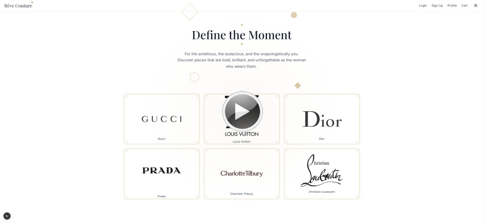

# 🌟 Rêve Couture - Luxury Fashion E-Commerce Platform

<div align="center">


*Where dreams meet luxury fashion*

[🚀 Live Demo](https://reve-couture.vercel.app/) • [📱 Features](#-features) • [🛠️ Tech Stack](#-tech-stack) 

</div>

[](https://www.youtube.com/watch?v=LBKFsljS-3Y)

> **Note:** The backend is hosted on Render's free tier. If the data doesn't load immediately, please wait **30-60 seconds** for the server to wake up.

## ⚠️ DISCLAIMER: Educational Project Only

> **Please Read Before Using -**
>
> This project is a **demo** created for **educational and learning purposes only**.
>
> * **NO real products** are sold here.
> * **NO real payments** are processed.
> * **DO NOT enter real personal information** (such as credit card numbers, home addresses, or private emails) in any forms or checkout pages.
>
> All data used in this application is mock data for demonstration purposes.

---

## ✨ Overview

**Rêve Couture** is a sophisticated luxury fashion e-commerce platform that brings together the world's most prestigious brands in an elegant, user-friendly interface. Experience the pinnacle of online luxury shopping with our carefully curated collection of high-end fashion, beauty, and accessories.

### 🎯 Key Highlights

- **6 Premium Brands**: Gucci, Louis Vuitton, Dior, Prada, Charlotte Tilbury, Christian Louboutin
- **Interactive Product Cards**: 3D flip animations revealing detailed product information
- **Seamless Dark/Light Mode**: Elegant theme switching with optimized brand logos
- **Complete Shopping Experience**: Cart, checkout, and order confirmation flow
- **User Profile Management**: Personalized accounts with photo upload capabilities
- **Responsive Design**: Perfect experience across all devices

---

## 🚀 Features

### 🛍️ **Shopping Experience**
- **Interactive Product Browsing**: Hover-to-flip cards showcasing 6 products per brand
- **Smart Image Loading**: Automatic fallback system for different image formats
- **Shopping Cart**: Add/remove items with real-time price calculations
- **Secure Checkout**: Complete payment flow with address and card information
- **Order Confirmation**: Celebration popup with order success feedback

### 🎨 **Visual Design**
- **Luxury Aesthetic**: Gold accents and premium color schemes
- **Brand-Specific Styling**: Customized layouts for each luxury brand
- **Smooth Animations**: Framer Motion powered transitions and hover effects
- **Optimized Product Images**: Smart scaling and positioning for perfect display
- **Consistent Branding**: Unified design language across all pages

### 👤 **User Management**
- **Profile Creation**: User accounts with customizable information
- **Order History**: Track past purchases and order status
- **Theme Preferences**: Persistent dark/light mode selection

### 🔧 **Technical Features**
- **Next.js 15**: Latest React framework with App Router
- **TypeScript**: Full type safety and enhanced developer experience
- **Tailwind CSS**: Utility-first styling with custom design system
- **Image Optimization**: Next.js Image component with fallback handling
- **Responsive Layout**: Mobile-first design approach

---

## 🛠️ Tech Stack

### **Frontend**
- **Framework**: Next.js 15.5.4 with App Router
- **Language**: TypeScript 5.0
- **Styling**: Tailwind CSS 3.4
- **Animations**: Framer Motion
- **Icons**: Lucide React
- **Theme**: next-themes

### **Development Tools**
- **Linting**: ESLint with Next.js config
- **Build Tool**: Turbopack (Next.js)
- **Package Manager**: npm
- **Version Control**: Git

---


## 🚀 Getting Started

This project consists of a **Backend (Node.js/Express)** and a **Frontend (React/Next.js)**.  
You will need to run them in **two separate terminals**.

### **Prerequisites**
- Node.js 18.0 or later  
- npm or yarn package manager

---

### **Installation & Setup**

```bash
# 1. Clone the repository and enter project folder
git clone https://github.com/maitreesharmaa/reve-couture.git
cd reve-couture

# ===== Terminal 1: Start the Backend =====
# Open one terminal, run these commands:
cd backend
npm install
# Start the backend server
npm run dev

# Note: keep this terminal running for the backend.

# ===== Terminal 2: Start the Frontend =====
# Open a SECOND terminal, run these commands (from project root or re-navigate)
cd reve-couture
cd frontend
npm install
# Start the frontend application
npm run dev

# After both servers are running:
# ===== Open in Browser =====
# Visit:
# http://localhost:3000
```

---


## 🎨 Design System

### **Color Palette**
- **Primary Gold**: `#C0A062` - Luxury accent color
- **Background**: White/Light Gray (Light Mode)
- **Background**: Dark Gradient (Dark Mode)
- **Text**: High contrast for accessibility

### **Typography**
- **Headings**: Custom cursive font for elegance
- **Body**: Clean, readable sans-serif
- **Accents**: Gold highlights for premium feel

### **Components**
- **Cards**: Rounded corners with subtle shadows
- **Buttons**: Gold accents with hover animations
- **Forms**: Clean inputs with validation states
- **Navigation**: Smooth transitions and hover effects

---


## 📄 License

This project is licensed under the MIT License - see the [LICENSE](LICENSE) file for details.

---

## 🙏 Acknowledgments

- **Next.js Team** for the amazing framework
- **Tailwind CSS** for the utility-first approach
- **Framer Motion** for smooth animations
- **Luxury Brands** for inspiration and product imagery

---

<div align="center">

**Made with ✨ and luxury in mind**

[⬆ Back to Top](#-rêve-couture---luxury-fashion-e-commerce-platform)

</div>
